# AppSec Vulnerability Management Program

This project simulates the implementation of a lightweight Application Security vulnerability management workflow using Azure, Terraform, GitHub Actions, and common AppSec scanning tools.

***Inception State:*** the application has no formal AppSec vulnerability workflow, no repeatable scan process, no OWASP Top 10 mapping, no documented remediation ownership, and no evidence-based validation process after fixes are made.

***Completion State:*** Azure infrastructure is deployed with Terraform, a training application is hosted on Azure App Service, AppSec scanning is integrated into GitHub Actions, findings are mapped to OWASP Top 10, remediation actions are documented, and closure can be validated through re-scanning.

---

## Video Presentation

This walkthrough explains the lab story from deployment to AppSec vulnerability management: Azure infrastructure, CI/CD security checks, finding triage, OWASP mapping, remediation ownership, and validation evidence.

<a href="https://www.youtube.com/watch?v=fw18MEuLPNg">
  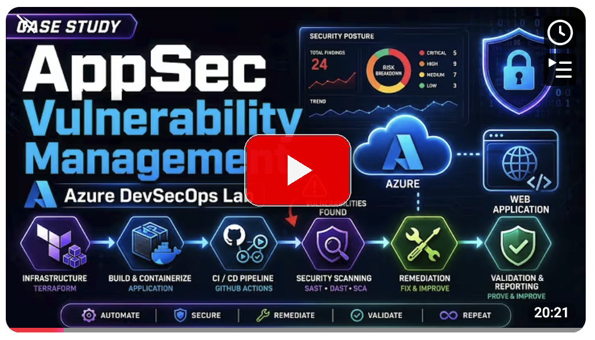
</a>

[Watch the presentation on YouTube](https://www.youtube.com/watch?v=fw18MEuLPNg)

---

## Architecture at a Glance

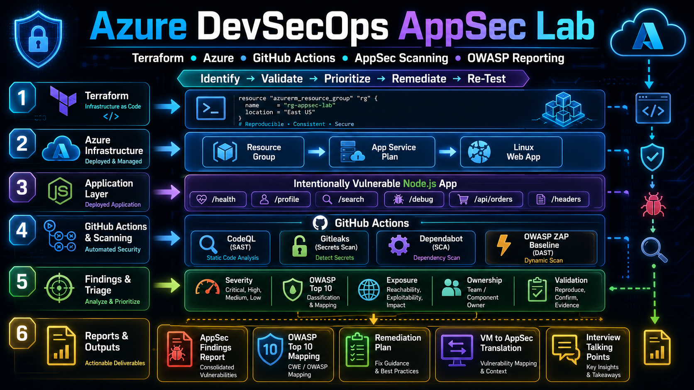

---

## Technology Stack

- Terraform
- Azure App Service
- Node.js / Express
- Docker
- GitHub Actions
- CodeQL
- Gitleaks
- Dependabot
- Trivy
- Checkov
- OWASP ZAP Baseline
- OWASP Top 10

---

## Table of Contents

- [Video Presentation](#video-presentation)
- [AppSec Lifecycle](#appsec-lifecycle)
- [Architecture at a Glance](#architecture-at-a-glance)
- [Technology Stack](#technology-stack)
- [Build and Deployment Flow](#build-and-deployment-flow)
- [Security Testing Coverage](#security-testing-coverage)
- [Application Risk Scenarios](#application-risk-scenarios)
- [Finding Intake, Risk Mapping, and Ownership](#finding-intake-risk-mapping-and-ownership)
- [Remediation and Validation Proof](#remediation-and-validation-proof)
- [Secure SDLC Alignment](#secure-sdlc-alignment)
- [Program Outcome](#program-outcome)
- [Supporting Documentation](#supporting-documentation)
- [What I Would Improve Next](#what-i-would-improve-next)

---

## AppSec Lifecycle

This project uses one repeatable lifecycle for handling application security findings:

1. Identify application risk.
2. Validate that the finding is real.
3. Map to OWASP and secure SDLC concepts.
4. Prioritize based on exposure, exploitability, and business impact.
5. Assign remediation ownership.
6. Remediate (fix the issue).
7. Re-test and capture closure evidence.

---

## Build and Deployment Flow

| Layer | Tool | Purpose |
| --- | --- | --- |
| Infrastructure | Terraform | Builds Azure Resource Group, App Service Plan, and Linux Web App |
| Cloud Runtime | Azure App Service | Hosts the training application |
| Application | Node.js / Express | Provides controlled AppSec test routes |
| Container | Docker | Packages the app as a scannable container image |
| CI/CD | GitHub Actions | Runs deployment and security workflows |

| Deployment Evidence | Why It Matters |
| --- | --- |
| 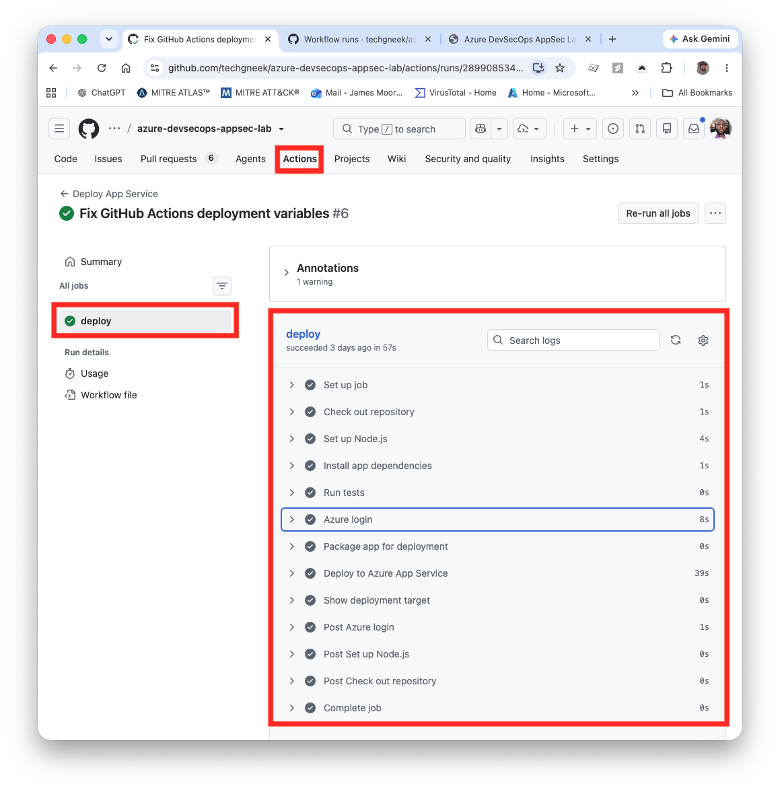 | Shows deployment is handled through CI/CD instead of manual upload. |

Detailed setup commands and local run instructions are kept in `LAB-GUIDE.md` and `infra/README.md` so the main README stays focused on the end-to-end program flow.

---

## Security Testing Coverage

| Security Area | Tool | What It Shows |
| --- | --- | --- |
| SAST | CodeQL | Source code analysis |
| Secrets Scanning | Gitleaks | Hardcoded secret detection |
| SCA | Dependabot | Dependency risk monitoring |
| Container Security | Trivy | Container image vulnerability scanning |
| IaC Security | Checkov | Terraform misconfiguration scanning |
| DAST | OWASP ZAP Baseline | Running app testing |

| Scan Evidence | Why It Matters |
| --- | --- |
| 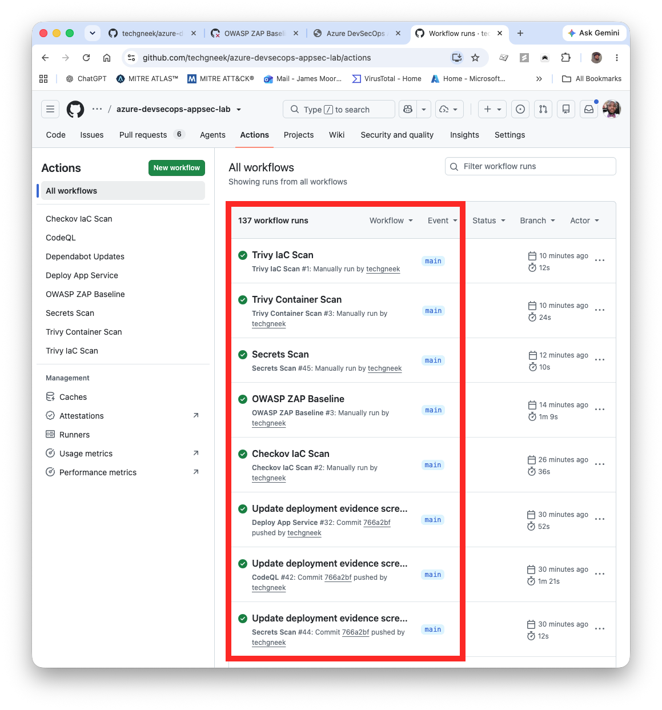 | Shows security workflows are correctly configured and executed in CI, with successful run status across the scanning stack used in this lab. |

This is where the lab shifts from being a vulnerable app to being an AppSec workflow. The scans create signals, and the reports turn those signals into prioritized remediation work.

---

## Application Risk Scenarios

The app contains routes that demonstrate common application security concerns in a safe, controlled way.

| Route | Screenshot | AppSec Concept |
| --- | --- | --- |
| `/` | 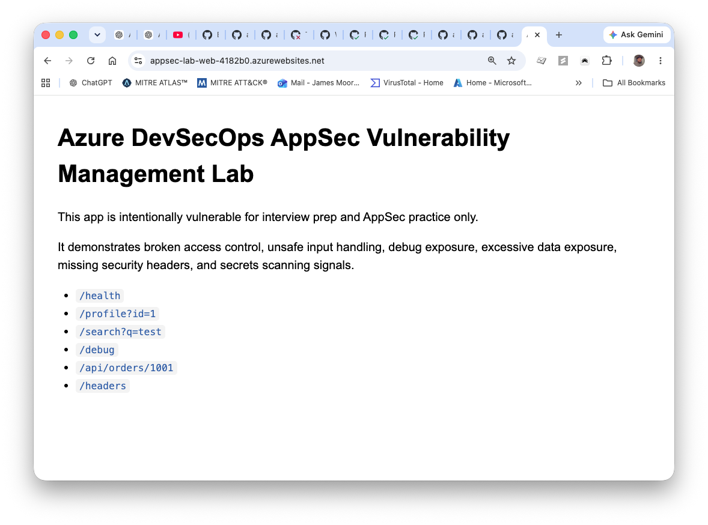 | Lab landing page and route map |
| `/profile?id=1` | 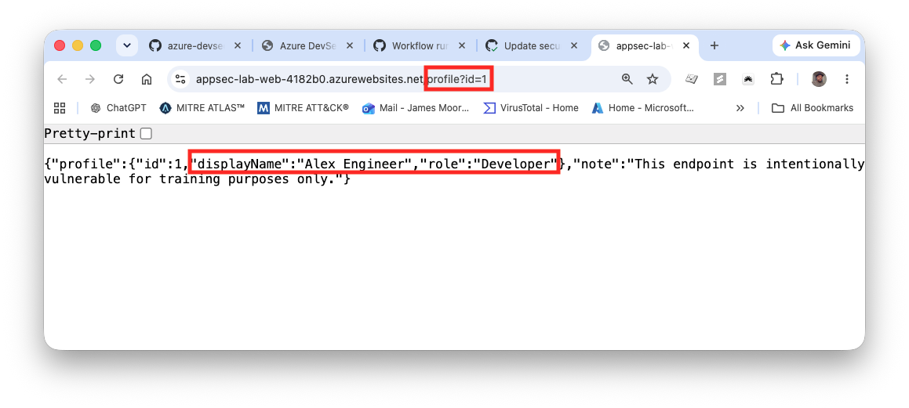 | Broken access control / IDOR-style behavior |
| `/profile?id=2` | 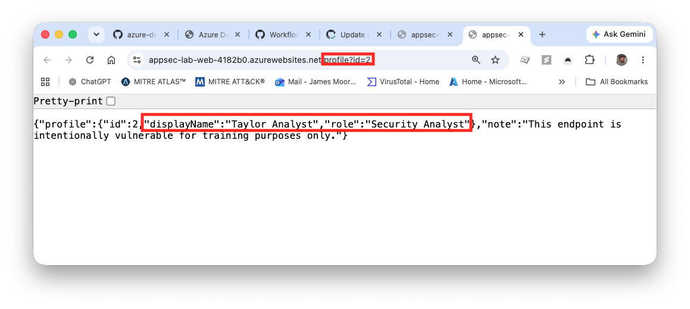 | Direct object reference returns a different profile without object-level authorization enforcement |
| `/debug` | 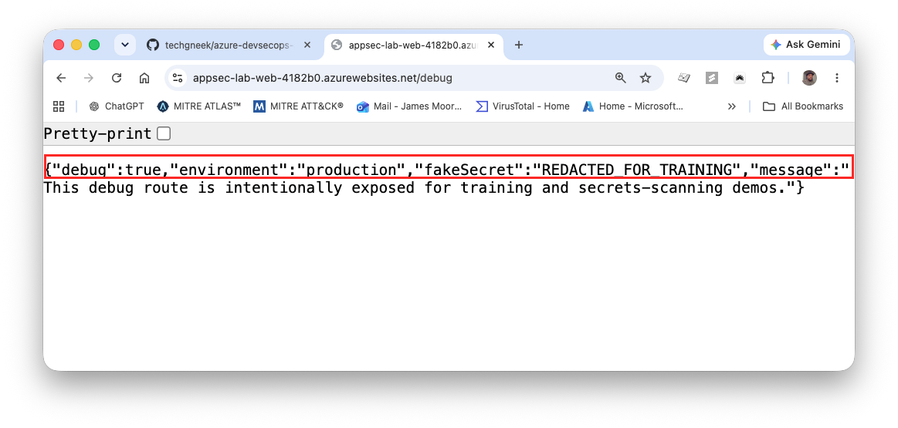 | Debug exposure and secret-handling risk |
| `/api/orders/:id` | 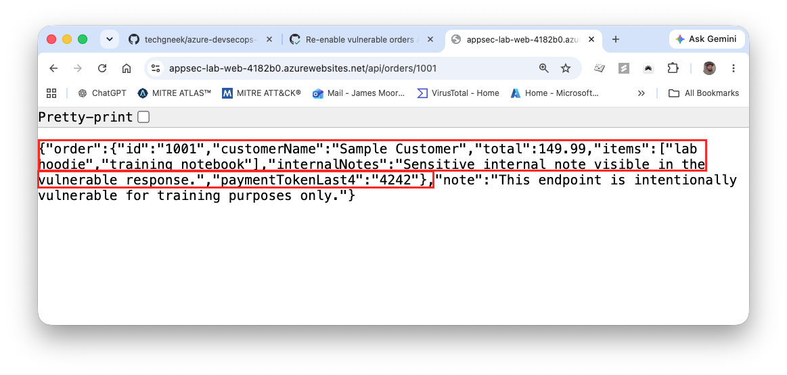 | Excessive data exposure in API responses |
| `/headers` | 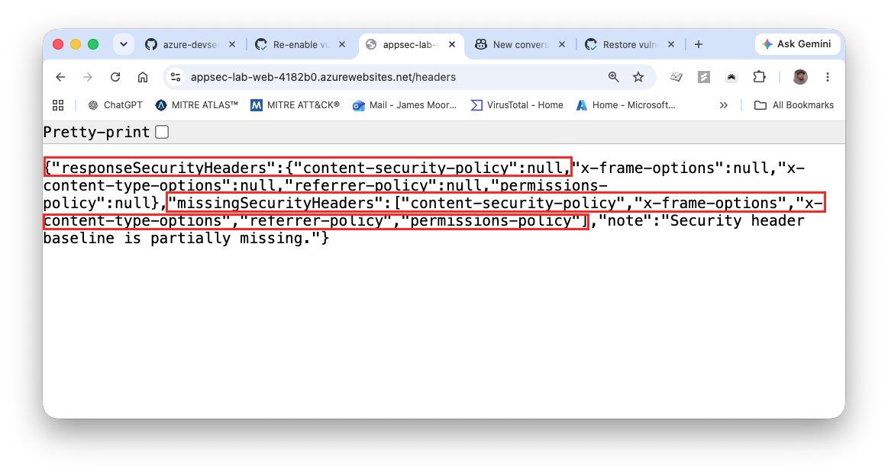 | Missing browser security headers |

The point is not to exploit anything. The point is to show how a security analyst can observe application behavior, identify risk patterns, collect evidence, and translate the issue into remediation guidance.

### Before Evidence: Broken Access Control (`/profile?id=1`)

- Before signal: profile data is returned for direct identifier input without an ownership validation check in the request flow.
- Risk meaning: this reflects an IDOR-style broken access control pattern where object access is not constrained to the requesting identity.
- Significance: a user should never be able to change only a profile identifier and retrieve another analyst's account data.

### Before Evidence: Debug Exposure (`/debug`)

- Before signal: the debug route returns internal application/runtime details that are not required for normal user-facing behavior.
- Risk meaning: this is an information disclosure pattern that improves attacker reconnaissance and reduces uncertainty for follow-on attacks.
- Significance: publicly accessible debug data lowers attacker effort by revealing internal context that should stay restricted.

### Before Evidence: API Data Exposure (`/api/orders/:id`)

- Before signal: the orders API response includes internal order attributes beyond what a consumer-facing client requires.
- Risk meaning: this is an excessive data exposure pattern where unnecessary fields increase data leakage risk and downstream misuse potential.
- Significance: exposing internal-only fields increases the chance of sensitive business and payment-adjacent data being reused outside intended workflows.

### Before Evidence: Missing Security Headers (`/headers`)

- Before signal: browser-facing security headers are absent or incomplete in HTTP responses.
- Risk meaning: this weakens baseline client-side protections and increases exposure to common browser-mediated attack classes.
- Significance: missing baseline headers removes built-in browser safeguards that help limit framing, content-type abuse, and unsafe content execution.

---

## Finding Intake, Risk Mapping, and Ownership

This section focuses on discovery-phase analysis using one ticket, before moving into remediation.

### AF-004 Ticket Walkthrough (Full Process)

Ticket source: `issues/AF-004-excessive-api-data-exposure.md`

| Ticket Phase | AF-004 Ticket Detail |
| --- | --- |
| Identification | **Finding ID: AF-004** on **`GET /api/orders/:id`** with excessive data exposure |
| Ownership and priority | Suggested owner: **API owner**, Priority: **P1** |
| Problem statement | Public response included **internal-only fields** (for example `internalNotes`, `paymentTokenLast4`) not required by clients |
| OWASP linkage | Mapped to **OWASP A01: Broken Access Control** (data exposure impact) |
| Risk statement | **Over-shared payloads increase blast radius** and leak internal operational/payment-adjacent data |
| Recommended remediation | **Minimize response to required fields only**; remove internal fields from public payloads; add response schema tests |
| Validation plan | Capture **before payload**, apply minimization fix, capture **after payload**, then update finding status with evidence |
| Definition of done | **Internal fields removed** from public response, tests validate contract shape, finding updated with closure evidence |

### AF-004 Risk and Control Mapping

| Mapping Area | AF-004 Context |
| --- | --- |
| OWASP mapping | `reports/owasp-top-10-mapping.md` maps AF-004 to **OWASP A01: Broken Access Control** because the API returns data beyond intended caller need. |
| Secure SDLC / NIST context | `reports/secure-sdlc-nist-mapping.md` maps AF-004 activities to **triage governance, remediation planning, and evidence-based closure** within secure SDLC operations. |
| Findings report linkage | `reports/appsec-findings-report.md` records **severity, business risk, owner, and validation references** for AF-004. |

### AF-004 Ownership Snapshot

- Finding ID: AF-004
- Owner: **API owner**
- Risk: **excessive API response data exposure**
- Ticket: `issues/AF-004-excessive-api-data-exposure.md`
- Priority: **P1**
- Discovery-phase handoff: ticket prepared for **remediation planning and implementation** in the next section.
- Validation reference: before/after evidence for `/api/orders/1001` in `screenshots/`

### Full Vulnerability Reports

For the complete set of findings and full vulnerability coverage, see:

- `reports/appsec-findings-report.md`
- `reports/owasp-top-10-mapping.md`
- `reports/remediation-plan.md`
- `reports/secure-sdlc-nist-mapping.md`
- `issues/`

---

## Remediation and Validation Proof

This section shows one complete remediation cycle for AF-004, from before evidence through after-fix validation.
Remediation actions follow the AF-004 ticket recommendations in `issues/AF-004-excessive-api-data-exposure.md`: return only required consumer fields, remove internal-only fields, and validate with automated tests plus post-fix scanning.

| Finding | Before | After | Validation |
| --- | --- | --- | --- |
| AF-004 API Data Exposure | API returned internal fields (`internalNotes`, `paymentTokenLast4`) | Response minimized to required fields only (`id`, `customerName`, `total`, `items`) | Re-tested `/api/orders/1001` and re-ran security validation workflow evidence |

### AF-004 API Data Exposure Before/After

| Before | After |
| --- | --- |
|  | 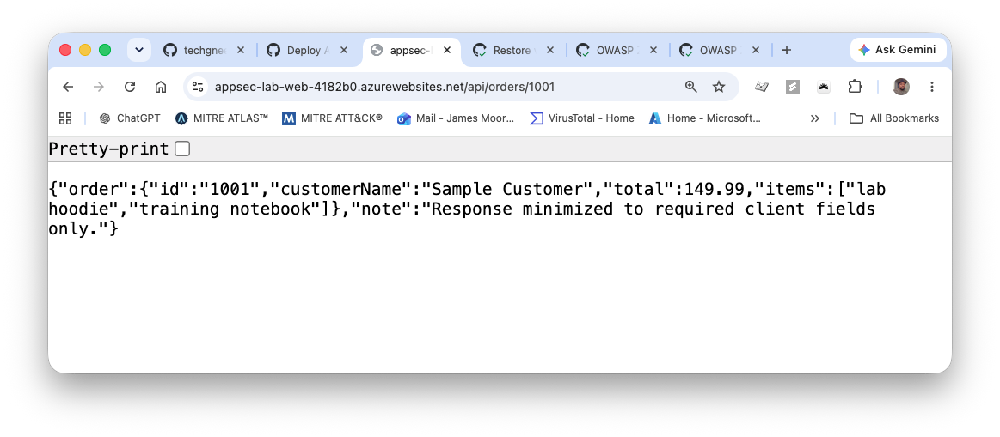 |

### AF-004 Remediation Implementation Evidence

| Implementation Evidence | Why It Matters |
| --- | --- |
| 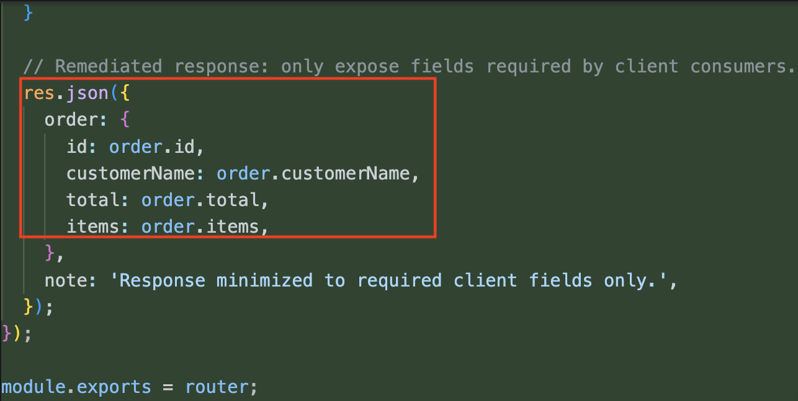 | Shows the API response was explicitly minimized to `id`, `customerName`, `total`, and `items` per ticket guidance. |
| 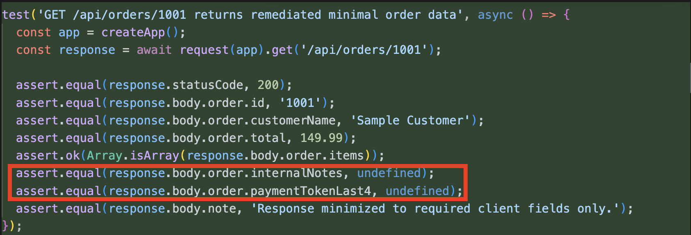 | Confirms automated tests enforce that `internalNotes` and `paymentTokenLast4` are no longer exposed. |

### AF-004 Validation Scan Evidence

| Validation Scan Evidence | Why It Matters |
| --- | --- |
| 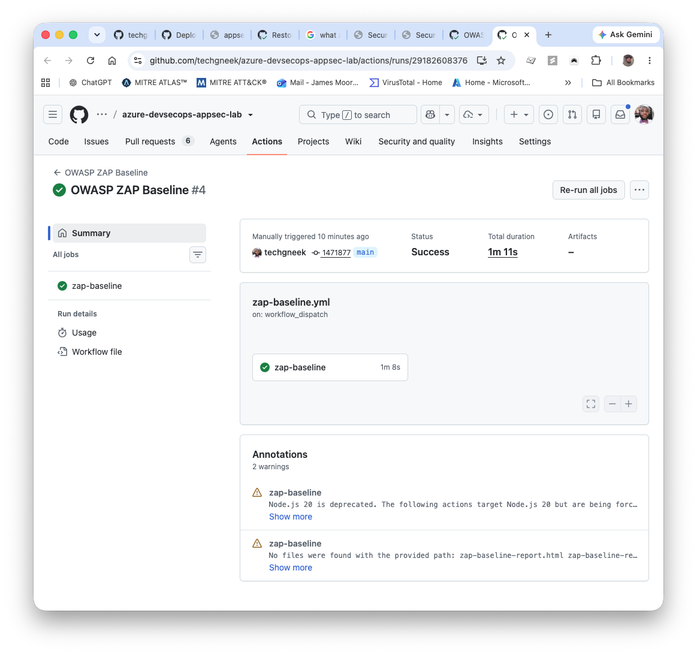 | Shows OWASP ZAP Baseline completed successfully after remediation to support closure evidence for AF-004. |

### Enterprise Change-Control Workflow (Real Environment)

In a production enterprise setting, a high-severity finding like AF-004 would normally follow formal change-control and separation-of-duties steps before closure.

| Enterprise Step | Typical Owner | Governance Outcome |
| --- | --- | --- |
| Security triage confirms severity and remediation requirement | AppSec / Vulnerability Management | Finding is risk-ranked and prepared for formal change submission |
| Change request is submitted and approved through change management (for example CAB) | Service owner / Engineering manager | Production implementation is authorized with scope, timing, and rollback expectations |
| Assigned engineer implements the approved remediation | API owner / Application developer | Approved fix is deployed in the defined change window |
| Vulnerability management performs independent re-test and evidence review | Vulnerability Management / AppSec | Closure is based on validation evidence, not implementation claim alone |
| Ticket status is updated to closed with linked proof artifacts | Finding owner + reviewer | Audit-ready traceability from finding to verified remediation |
| Post-closure lessons learned and analyst notes are documented | Vulnerability Management + AppSec + Engineering | Reusable knowledge is captured so similar findings are triaged and remediated faster in future cycles |

---

## Secure SDLC Alignment

This lab maps to secure SDLC phases in practical terms:

- **Design:** define AppSec workflow, risk triage method, and OWASP mapping.
- **Build:** implement Terraform infrastructure and application code changes.
- **Test:** run SAST, DAST, SCA, secrets scanning, container scanning, and IaC scanning.
- **Release:** deploy through a CI/CD workflow in GitHub Actions.
- **Operate:** track findings, assign owners, prioritize remediation, and validate closure with evidence.

---

## Program Outcome

This project demonstrates an end-to-end AppSec vulnerability management workflow in a controlled Azure lab environment.

| Outcome | Result |
| --- | --- |
| Cloud infrastructure | Azure App Service environment provisioned with Terraform |
| Application target | Intentionally vulnerable Node.js app deployed for safe AppSec testing |
| Scanning layers | SAST, DAST, SCA, secrets scanning, container scanning, and IaC scanning represented |
| Findings documented | 7 AppSec findings captured in a triage report |
| OWASP mapping | Findings mapped to common OWASP Top 10 categories |
| Remediation plan | Findings prioritized by exposure, exploitability, and business risk |
| Validation loop | Re-test steps documented for each major finding |

The strongest takeaway is that AppSec is not disconnected from vulnerability management. The workflow is familiar: identify, validate, prioritize, assign ownership, remediate, and re-test.

As a final summary, this project demonstrates an end-to-end AppSec vulnerability management workflow in a controlled Azure lab. It combines infrastructure provisioning, CI/CD-integrated scanning, OWASP-based categorization, remediation ownership, and evidence-based validation to show how findings move from detection to closure.

## Supporting Documentation

Use the files below for setup details, report depth, and remediation evidence:

- `LAB-GUIDE.md`
- `SECURITY.md`
- `infra/README.md`
- `reports/appsec-findings-report.md`
- `reports/remediation-plan.md`
- `reports/owasp-top-10-mapping.md`
- `reports/secure-sdlc-nist-mapping.md`
- `reports/remediation-rounds.md`
- `reports/container-security-notes.md`
- `reports/iac-security-notes.md`
- `issues/`

## What I Would Improve Next

- Add a standardized triage worksheet per finding to reduce review variability.
- Integrate ASM / CAASM tooling for broader asset and exposure visibility.
- Add SOAR-style automation to create tickets from validated findings.
- Add Jenkins as an additional CI/CD pipeline example.
- Add deeper authentication and authorization workflows.
- Add API schema testing and rate-limit testing.
- Expand secure coding examples with before/after pull requests.
- Expand framework mapping with more specific NIST SSDF, NIST CSF, and CIS Controls references.
- Add trend tracking across scan cycles to show reduction over time.
- Add defined SLA targets by severity for simulated AppSec operations.
