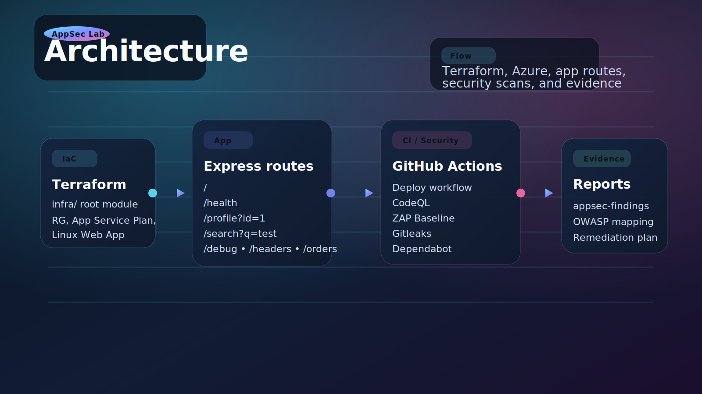
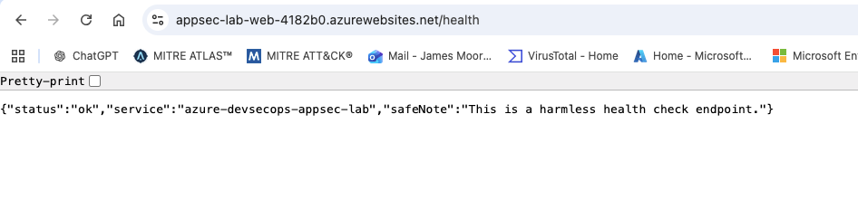
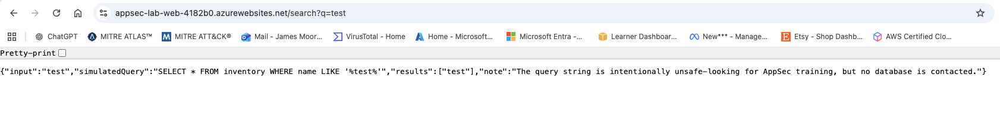

# Azure DevSecOps AppSec Vulnerability Management Lab

This walkthrough is structured like a tutorial. We move from infrastructure to app routes, then to CI/CD, security scans, and the reports that pull the evidence together.

The chronology follows the same build, validate, inspect, prioritize, confirm flow you would use in vulnerability management, but the main focus here is showing how the lab works end to end.

## Guided Walkthrough

1. Start with Terraform in `infra/` to create the Azure resource group, App Service Plan, and Linux Web App.
2. Deploy the training app so the intentionally vulnerable routes are live in a predictable environment.
3. Exercise the endpoints in the browser and observe how each route exposes a different AppSec lesson.
4. Run the GitHub Actions workflows for deployment, CodeQL, secrets scanning, and dependency monitoring.
5. Use the reports in `reports/` to map findings back to OWASP Top 10 and to the remediation plan.

## Architecture at a Glance

## Evidence Snapshot

| Stage | Screenshot | Why it matters |
| --- | --- | --- |
| Deployment |  | Shows the app being deployed through Actions instead of manually copied into App Service. |
| Static analysis |  | Shows the code scanning pipeline and the warnings that came out of it. |
| Secrets scan |  | Shows the scan workflow catching the lab secret exposure and reporting it back cleanly. |
| Route review |  | Shows how the app returns route-level evidence for the security walkthrough. |

If you want the strongest live demo flow, open the README from top to bottom and follow the same order: infrastructure, app behavior, pipeline evidence, then the reports.

## Route Tour

This is the part of the walkthrough where I open the app and move through the routes in a deliberate order. The goal is to show that the lab is not a random collection of endpoints, but a structured set of examples that each demonstrate one security concept.

| Route | Screenshot | What it shows |
| --- | --- | --- |
| Home |  | The landing page gives the map of the lab and sets up the rest of the walkthrough. |
| Health |  | A safe baseline endpoint that confirms the app is running. |
| Profile |  | A user-facing endpoint that illustrates direct object access in a simple form. |
| Search |  | A deliberately unsafe-looking query flow that helps explain input handling concerns. |
| Debug |  | A route that exposes debug details and a fake secret for scanning demos. |
| Orders |  | A richer JSON response that shows excessive data exposure in the API layer. |
| Headers |  | A route centered on missing security headers and how the app documents that gap. |

When I present this live, I keep the order consistent: homepage first, then the safer endpoint, then the more revealing ones, and finally the route that ties back to headers and response hardening.

## Scans And Findings

After the route tour, I move into the security evidence. This is where the lab shows the difference between a vulnerable app and an AppSec workflow: the workflows detect issues, the reports explain them, and the OWASP mapping puts them into a category the team can discuss.

| Signal | Tool | What I look for | Supporting report |
| --- | --- | --- | --- |
| Code quality and code paths | CodeQL | Broken access control patterns, unsafe input handling, and other code-level issues | [AppSec findings report](reports/appsec-findings-report.md) |
| Secret exposure | Gitleaks / Secrets scan | Hardcoded secret patterns and any cleanup needed after removal | [Remediation plan](reports/remediation-plan.md) |
| Dependency risk | Dependabot | Outdated or vulnerable packages that need review and update | [OWASP mapping](reports/owasp-top-10-mapping.md) |
| Active app hardening checks | ZAP baseline | Missing headers and other response hardening gaps | [AppSec findings report](reports/appsec-findings-report.md) |

The main findings in this lab line up with broken access control, security misconfiguration, injection, and vulnerable components. That is the point of the walkthrough: show the route, show the scan, and then show the report that explains why it matters.

If I were explaining the flow live, I would keep it simple: the app exposes the behavior, the scanners catch the signal, and the reports translate it into OWASP language and remediation actions.

## Remediation Loop

This is the final step in the walkthrough. Once a finding is confirmed, I treat it the same way I would in vulnerability management: assign it to an owner, define the fix, re-run the scan, and document the result.

| Step | What Happens | Where It Shows Up |
| --- | --- | --- |
| Confirm | Reproduce the issue in the route, workflow, or dependency | [AppSec findings report](reports/appsec-findings-report.md) |
| Prioritize | Rank by exposure, exploitability, and data sensitivity | [Remediation plan](reports/remediation-plan.md) |
| Translate | Map the issue into OWASP Top 10 language | [OWASP Top 10 mapping](reports/owasp-top-10-mapping.md) |
| Fix | Remove the risky behavior, harden the app, or update the dependency | [Vulnerability management translation](reports/vulnerability-management-to-appsec-translation.md) |
| Validate | Re-run the relevant scan or re-test the route | [Remediation plan](reports/remediation-plan.md) |

The key message is that the lab is not just about finding flaws. It is about showing the full loop from exposure to evidence to closure, with enough structure to explain each step clearly during a walkthrough.

## Live Demo Flow

This is the order I would use when presenting the lab live.

1. Start at the top of the README and point to the architecture diagram so the audience sees the full shape of the lab.
2. Open the route tour and move from the home page to the safer endpoints before showing the more revealing ones.
3. Pause on the debug, orders, and headers routes to explain what kind of issue each one represents.
4. Jump to the scans and findings section so the audience sees how CodeQL, Gitleaks, Dependabot, and ZAP turn behavior into evidence.
5. Finish with the remediation loop and explain how each finding gets assigned, fixed, and re-tested.
6. Use the [interview talking points](reports/interview-talking-points.md) if you want a short version of the same story for conversation.

The sequence matters because it keeps the story linear: build the environment, exercise the app, collect the signals, and close the loop.

## Lab Overview

This repository contains a small Azure-hosted training environment built in phases:

- Terraform provisions the Azure infrastructure.
- A small intentionally vulnerable Node.js app demonstrates common AppSec issues.
- GitHub Actions shows CI/CD plus SAST, DAST, SCA, and secrets scanning.
- The reports folder maps findings to OWASP Top 10 and remediation priorities.

## Architecture Summary

- `infra/` provisions an Azure Resource Group, Linux App Service Plan, and Linux Web App.
- `app/` contains the intentionally vulnerable training application.
- `.github/workflows/` contains deployment and security scanning automation.
- `reports/` contains AppSec findings, OWASP mapping, remediation guidance, and interview notes.

## What The Lab Teaches

- Infrastructure as Code with Terraform
- Azure App Service deployment
- GitHub Actions CI/CD
- SAST
- DAST
- SCA / dependency scanning
- Secrets scanning
- OWASP Top 10
- AppSec vulnerability triage
- Remediation coordination
- How vulnerability management maps to AppSec

## Tools Used

- Terraform
- Azure App Service on Linux
- Node.js and Express
- GitHub Actions
- CodeQL
- OWASP ZAP baseline scan
- Gitleaks
- Dependabot

## How Terraform Fits

Terraform is the lab foundation. It creates the Azure resource group, low-cost Linux App Service Plan, and Linux Web App that will host the app. The Terraform layer also demonstrates naming, outputs, tagging, and cleanup discipline.

## How GitHub Actions Fits

GitHub Actions represents the DevSecOps pipeline. It installs dependencies, runs tests, deploys to Azure App Service, and runs security scanning workflows so you can see how application security is built into delivery instead of added afterward.

## Safety Warning

This is an intentionally vulnerable personal lab only. Do not scan or attack third-party systems. Only run DAST and other active testing against the Azure App Service deployed by this repository in your own subscription.

## Quick Start

1. Review [SECURITY.md](SECURITY.md) and [infra/README.md](infra/README.md).
2. Log in to Azure with `az login`.
3. Copy `infra/terraform.tfvars.example` to `infra/terraform.tfvars`.
4. Run Terraform from the `infra/` directory:
	- `terraform init`
	- `terraform fmt`
	- `terraform validate`
	- `terraform plan`
	- `terraform apply`
5. Capture the Terraform outputs, especially the app service URL.
6. Run the app locally from `app/` with `npm start`.
7. Use the GitHub Actions workflows to deploy and scan the app.
8. Read the reports in `reports/` to practice triage and walkthrough explanations.

## What I Would Improve Next

If I extended the lab, I would improve the process around it before I added more polish.

- Add a tighter triage flow so each finding goes from scan output to impact assessment to remediation priority faster.
- Add a repeatable validation checklist for each route and workflow so the demo proves the issue, the fix, and the retest in the same order every time.
- Capture a clearer before-and-after path for each remediation so the AppSec lesson is tied to an actual control or code change.
- Add a short decision log for why a finding is P1, P2, or P3 so the prioritization feels like real vulnerability management instead of just a lab exercise.

That would make the lab stronger as an AppSec process walkthrough because it would show how a team actually finds, validates, prioritizes, and closes issues.

