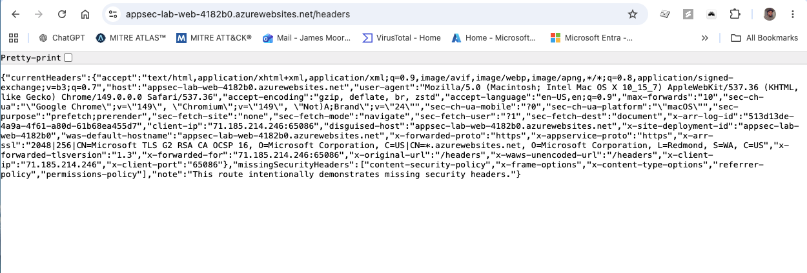
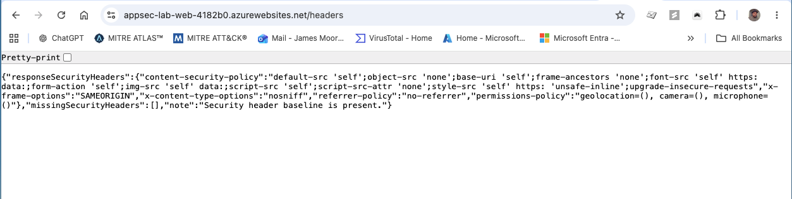
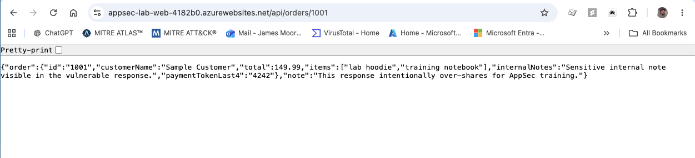
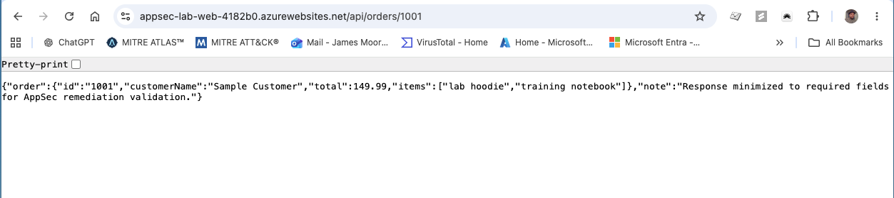

# Application Security Vulnerability Management Program Simulation

This project simulates the implementation of a lightweight Application Security vulnerability management workflow using Azure, Terraform, GitHub Actions, and common AppSec scanning tools.

***Inception State:*** the application has no formal AppSec vulnerability workflow, no repeatable scan process, no OWASP Top 10 mapping, no documented remediation ownership, and no evidence-based validation process after fixes are made.

***Completion State:*** Azure infrastructure is deployed with Terraform, a training application is hosted on Azure App Service, AppSec scanning is integrated into GitHub Actions, findings are mapped to OWASP Top 10, remediation actions are documented, and closure can be validated through re-scanning.

---

## Architecture at a Glance

---

## Technology Stack

- Terraform
- Azure App Service
- Node.js / Express
- Docker
- GitHub Actions
- CodeQL
- Gitleaks
- Dependabot
- Trivy
- Checkov
- OWASP ZAP Baseline
- OWASP Top 10

---

## Table of Contents

- [Project Summary](#project-summary)
- [Architecture at a Glance](#architecture-at-a-glance)
- [Technology Stack](#technology-stack)
- [AppSec Vulnerability Management Workflow](#appsec-vulnerability-management-workflow)
- [Build and Deployment Flow](#build-and-deployment-flow)
- [Security Testing Coverage](#security-testing-coverage)
- [Secure SDLC Alignment](#secure-sdlc-alignment)
- [Application Risk Scenarios](#application-risk-scenarios)
- [Findings, Risk Mapping, and Ownership](#findings-risk-mapping-and-ownership)
- [Remediation and Validation Proof](#remediation-and-validation-proof)
- [Program Outcome](#program-outcome)
- [What I Would Improve Next](#what-i-would-improve-next)
- [Supporting Documentation](#supporting-documentation)

---

## Project Summary

The goal of this project is to show how enterprise vulnerability management concepts translate into application security.

In traditional vulnerability management, the focus is usually on servers, endpoints, CVEs, scanner output, remediation owners, and validation. In AppSec, the same lifecycle still applies, but the assets shift to applications, APIs, source code, dependencies, secrets, containers, and CI/CD pipelines.

This lab demonstrates that lifecycle:

1. Build a controlled application environment.
2. Identify application security weaknesses.
3. Collect evidence through manual review and scanning workflows.
4. Map findings to OWASP Top 10.
5. Prioritize based on exposure, exploitability, and business risk.
6. Assign remediation actions to the correct owner.
7. Validate closure through re-testing.

---

## AppSec Vulnerability Management Workflow

This project uses one repeatable lifecycle for handling application security findings:

1. Identify application risk.
2. Validate that the finding is real.
3. Map it to OWASP and secure SDLC concepts.
4. Prioritize based on exposure, exploitability, and business impact.
5. Assign remediation ownership.
6. Fix the issue.
7. Re-test and capture closure evidence.

---

## Build and Deployment Flow

| Layer | Tool | Purpose |
| --- | --- | --- |
| Infrastructure | Terraform | Builds Azure Resource Group, App Service Plan, and Linux Web App |
| Cloud Runtime | Azure App Service | Hosts the training application |
| Application | Node.js / Express | Provides controlled AppSec test routes |
| Container | Docker | Packages the app as a scannable container image |
| CI/CD | GitHub Actions | Runs deployment and security workflows |

| Deployment Evidence | Why It Matters |
| --- | --- |
|  | Shows deployment is handled through CI/CD instead of manual upload. |

Detailed setup commands and local run instructions are kept in `LAB-GUIDE.md` and `infra/README.md` so the main README stays focused on the end-to-end program flow.

---

## Application Risk Scenarios

The app contains routes that demonstrate common application security concerns in a safe, controlled way.

| Route | Screenshot | AppSec Concept |
| --- | --- | --- |
| `/` |  | Lab landing page and route map |
| `/profile?id=1` |  | Broken access control / IDOR-style behavior |
| `/debug` |  | Debug exposure and secret-handling risk |
| `/api/orders/:id` |  | Excessive data exposure in API responses |
| `/headers` |  | Missing browser security headers |

The point is not to exploit anything. The point is to show how a security analyst can observe application behavior, identify risk patterns, collect evidence, and translate the issue into remediation guidance.

---

## Security Testing Coverage

| Security Area | Tool | What It Shows |
| --- | --- | --- |
| SAST | CodeQL | Source code analysis |
| Secrets Scanning | Gitleaks | Hardcoded secret detection |
| SCA | Dependabot | Dependency risk monitoring |
| Container Security | Trivy | Container image vulnerability scanning |
| IaC Security | Checkov | Terraform misconfiguration scanning |
| DAST | OWASP ZAP Baseline | Running app testing |

| Scan Evidence | Why It Matters |
| --- | --- |
|  | Shows code scanning attached to the repository. |
|  | Shows the lab detecting and validating a secrets exposure scenario. |

This is where the lab shifts from being a vulnerable app to being an AppSec workflow. The scans create signals, and the reports turn those signals into prioritized remediation work.

## Secure SDLC Alignment

This lab maps to secure SDLC phases in practical terms:

- **Design:** define AppSec workflow, risk triage method, and OWASP mapping.
- **Build:** implement Terraform infrastructure and application code changes.
- **Test:** run SAST, DAST, SCA, secrets scanning, container scanning, and IaC scanning.
- **Release:** deploy through a CI/CD workflow in GitHub Actions.
- **Operate:** track findings, assign owners, prioritize remediation, and validate closure with evidence.

---

## Findings, Risk Mapping, and Ownership

This section summarizes how findings are documented, mapped, and handed off for remediation.

Each finding is tracked with:

- finding ID
- tool or evidence source
- severity
- OWASP category
- business risk
- recommended fix
- owner
- status
- validation step

Issue-style handoff templates in `issues/` are used to simulate developer ownership and remediation workflow.

Detailed tracking and mapping are maintained in:

- `reports/appsec-findings-report.md`
- `reports/owasp-top-10-mapping.md`
- `reports/remediation-plan.md`
- `reports/secure-sdlc-nist-mapping.md`
- `issues/`

---

## Remediation and Validation Proof

This section shows the two primary remediation rounds and their validation outcomes.

| Finding | Before | After | Validation |
| --- | --- | --- | --- |
| AF-001 Security Headers | Missing baseline security headers | Hardened header set | Re-tested `/headers` and captured after evidence |
| AF-004 API Data Exposure | API returned internal fields | Response minimized to required fields | Re-tested `/api/orders/1001` and captured after evidence |

### AF-001 Security Headers Before/After

| Before | After |
| --- | --- |
|  |  |

### AF-004 API Data Exposure Before/After

| Before | After |
| --- | --- |
|  |  |

---

## Program Outcome

This project established a complete AppSec vulnerability management workflow in a controlled Azure lab environment.

| Outcome | Result |
| --- | --- |
| Cloud infrastructure | Azure App Service environment provisioned with Terraform |
| Application target | Intentionally vulnerable Node.js app deployed for safe AppSec testing |
| Scanning layers | SAST, DAST, SCA-style dependency monitoring, and secrets scanning represented |
| Findings documented | 7 AppSec findings captured in a triage report |
| OWASP mapping | Findings mapped to common OWASP Top 10 categories |
| Remediation plan | Findings prioritized by exposure, exploitability, and business risk |
| Validation loop | Re-test steps documented for each major finding |

The strongest takeaway is that AppSec is not disconnected from vulnerability management. The workflow is familiar: identify, validate, prioritize, assign ownership, remediate, and re-test.

---

### Live Demo Flow

1. Open the architecture image and explain inception versus completion state.
2. Show deployment evidence and route-level risk scenarios.
3. Walk through scan evidence from CodeQL and secrets scanning.
4. Move to triage, OWASP mapping, and remediation plan artifacts.
5. Close with validation examples and outcome summary.

## Supporting Documentation

Use the files below for setup details, report depth, and remediation evidence:

- `LAB-GUIDE.md`
- `SECURITY.md`
- `infra/README.md`
- `reports/appsec-findings-report.md`
- `reports/remediation-plan.md`
- `reports/owasp-top-10-mapping.md`
- `reports/secure-sdlc-nist-mapping.md`
- `reports/remediation-rounds.md`
- `reports/container-security-notes.md`
- `reports/iac-security-notes.md`
- `issues/`

## What I Would Improve Next

- Add a standardized triage worksheet per finding to reduce review variability.
- Integrate ASM / CAASM tooling for broader asset and exposure visibility.
- Add SOAR-style automation to create tickets from validated findings.
- Add Jenkins as an additional CI/CD pipeline example.
- Add deeper authentication and authorization workflows.
- Add API schema testing and rate-limit testing.
- Expand secure coding examples with before/after pull requests.
- Map findings to additional frameworks such as NIST SSDF, NIST CSF, and CIS Controls.
- Add trend tracking across scan cycles to show reduction over time.
- Add defined SLA targets by severity for simulated AppSec operations.

### Project Summary

This project demonstrates an end-to-end AppSec vulnerability management workflow in a controlled Azure lab. It combines infrastructure provisioning, CI/CD-integrated scanning, OWASP-based categorization, remediation ownership, and evidence-based validation to show how findings move from detection to closure.
