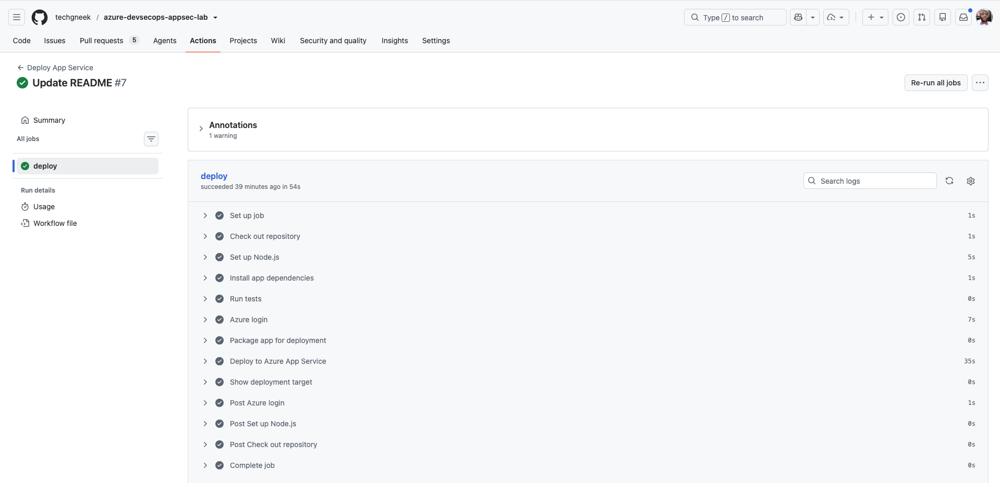
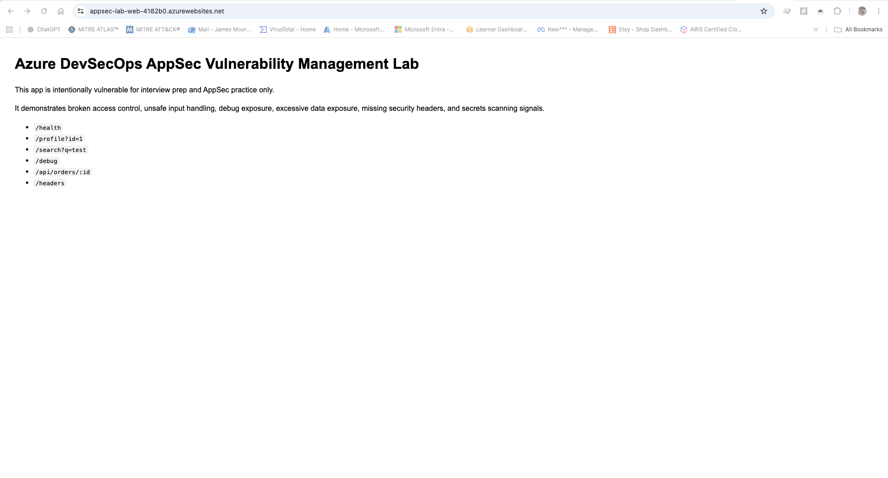
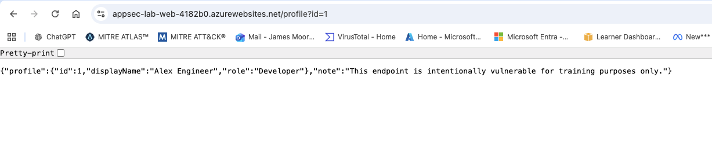
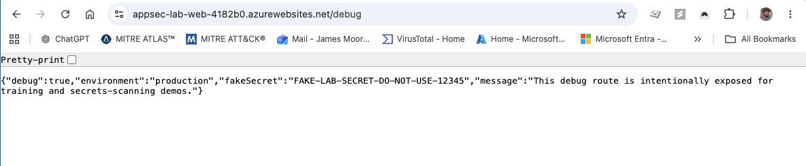
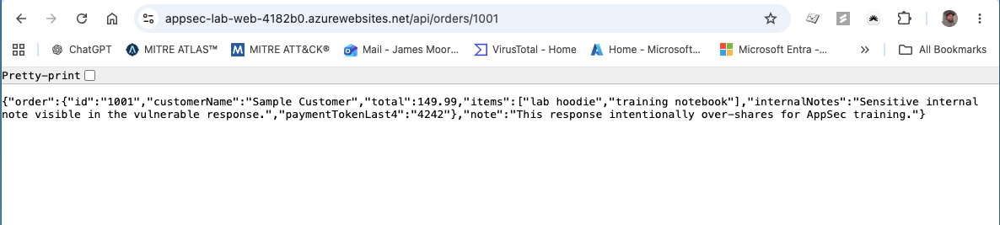
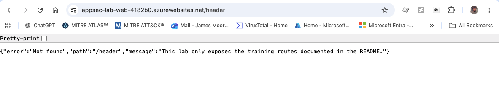
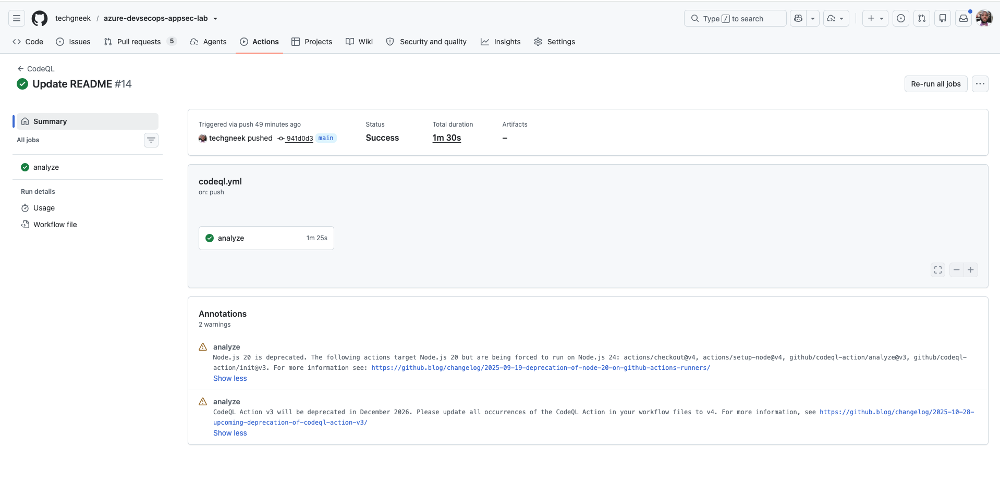
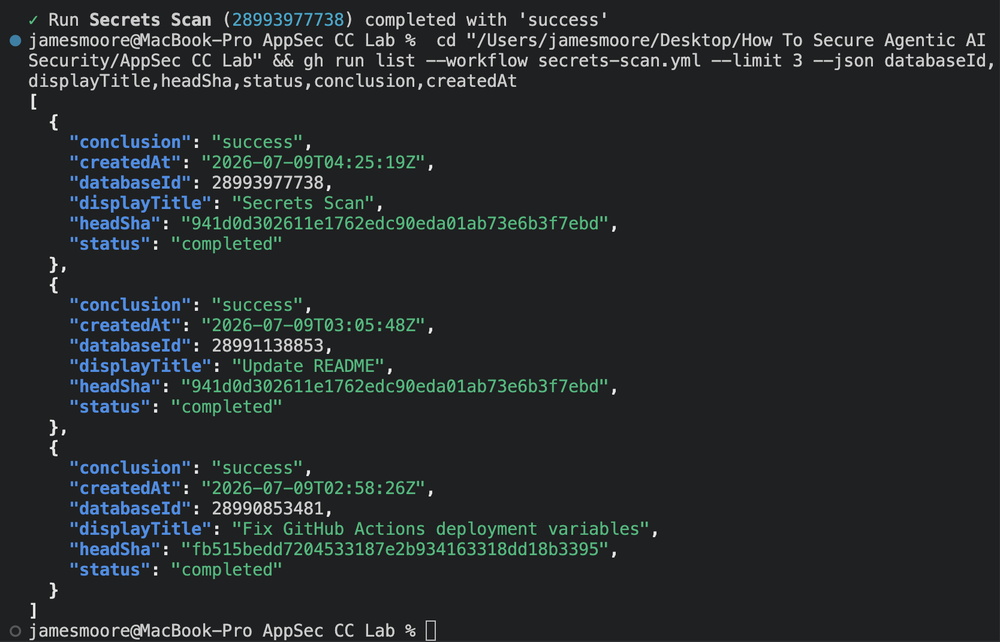

# Application Security Vulnerability Management Program Simulation

This project simulates the implementation of a lightweight Application Security vulnerability management workflow using Azure, Terraform, GitHub Actions, and common AppSec scanning tools.

***Inception State:*** the application has no formal AppSec vulnerability workflow, no repeatable scan process, no OWASP Top 10 mapping, no documented remediation ownership, and no evidence-based validation process after fixes are made.

***Completion State:*** Azure infrastructure is deployed with Terraform, a training application is hosted on Azure App Service, AppSec scanning is integrated into GitHub Actions, findings are mapped to OWASP Top 10, remediation actions are documented, and closure can be validated through re-scanning.

---


---

## Technology Utilized

- **Terraform** - infrastructure as code foundation
- **Azure App Service** - cloud-hosted application runtime
- **Node.js / Express** - intentionally vulnerable training application
- **GitHub Actions** - CI/CD and security scanning workflows
- **CodeQL** - SAST / source code analysis
- **Gitleaks** - secrets scanning
- **Dependabot** - dependency monitoring / SCA-style visibility
- **OWASP ZAP Baseline** - DAST-style passive testing against the running app
- **OWASP Top 10** - application risk categorization

---

## Table of Contents

- [Project Objective](#project-objective)
- [AppSec Program Lifecycle](#appsec-program-lifecycle)
- [Step 1: Define the AppSec Workflow](#step-1-define-the-appsec-workflow)
- [Step 2: Build the Azure Infrastructure](#step-2-build-the-azure-infrastructure)
- [Step 3: Deploy the Training Application](#step-3-deploy-the-training-application)
- [Containerization Readiness](#containerization-readiness)
- [Step 4: Review Application Risk Scenarios](#step-4-review-application-risk-scenarios)
- [Step 5: Integrate AppSec Scanning Into CI/CD](#step-5-integrate-appsec-scanning-into-cicd)
- [Step 6: Triage and Prioritize Findings](#step-6-triage-and-prioritize-findings)
- [Step 7: Map Findings to OWASP Top 10](#step-7-map-findings-to-owasp-top-10)
- [Step 8: Remediation Planning and Ownership](#step-8-remediation-planning-and-ownership)
- [Step 9: Validation and Re-Testing](#step-9-validation-and-re-testing)
- [Program Outcome Summary](#program-outcome-summary)
- [Live Demo Flow](#live-demo-flow)
- [Quick Start](#quick-start)
- [Safety Warning](#safety-warning)
- [What I Would Improve Next](#what-i-would-improve-next)
- [Interview Framing](#interview-framing)

---

## Project Objective

The goal of this project is to show how enterprise vulnerability management concepts translate into application security.

In traditional vulnerability management, the focus is usually on servers, endpoints, CVEs, scanner output, remediation owners, and validation. In AppSec, the same lifecycle still applies, but the assets shift to applications, APIs, source code, dependencies, secrets, containers, and CI/CD pipelines.

This lab demonstrates that lifecycle:

1. Build a controlled application environment.
2. Identify application security weaknesses.
3. Collect evidence through manual review and scanning workflows.
4. Map findings to OWASP Top 10.
5. Prioritize based on exposure, exploitability, and business risk.
6. Assign remediation actions to the correct owner.
7. Validate closure through re-testing.

---

## AppSec Program Lifecycle

| Program Phase | What Happens | Evidence In This Repository |
| --- | --- | --- |
| Build | Terraform creates the Azure resource group, App Service Plan, and Linux Web App | `infra/` |
| Deploy | GitHub Actions deploys the Node.js training app to Azure App Service | `.github/workflows/deploy.yml` |
| Identify | Routes intentionally expose AppSec learning scenarios | `app/` and route screenshots |
| Scan | CodeQL, Gitleaks, Dependabot, and ZAP provide AppSec signals | `.github/workflows/` |
| Triage | Findings are reviewed for severity, exposure, exploitability, and owner | `reports/appsec-findings-report.md` |
| Prioritize | Findings are ranked P1/P2/P3 using vulnerability management logic | `reports/remediation-plan.md` |
| Map | Issues are translated into OWASP Top 10 categories | `reports/owasp-top-10-mapping.md` |
| Validate | Fixes are re-tested through route review or scan workflow evidence | `reports/remediation-plan.md` |

---

## Step 1: Define the AppSec Workflow

The first step was to define the AppSec process the same way a vulnerability management program would define its operating model.

The workflow used in this project is:

1. **Discover** the weakness through a route, code path, dependency, or scan result.
2. **Validate** that the issue is reproducible and relevant.
3. **Classify** the issue using OWASP Top 10.
4. **Prioritize** based on exposure, severity, exploitability, and data sensitivity.
5. **Assign ownership** to the developer, API owner, or platform owner.
6. **Remediate** the underlying issue.
7. **Re-test** the app or scan workflow to confirm closure.

This mirrors the vulnerability management process I already understand, but applies it to application security instead of only infrastructure security.

---

## Step 2: Build the Azure Infrastructure

Terraform is used as the base infrastructure layer. The infrastructure creates a low-cost Azure environment for hosting the training app.

The Terraform deployment provisions:

- Azure Resource Group
- Linux App Service Plan
- Linux Web App
- App settings
- Resource tags
- Outputs for the app name, URL, region, and resource group

The Terraform files are located in `infra/`.

This step matters because it shows that the application security workflow is not just local code review. The app is deployed to a real cloud runtime where DAST and response validation can be performed against a live URL.

---

## Step 3: Deploy the Training Application

The application is a small intentionally vulnerable Node.js / Express training app. It is not intended for production use. Its purpose is to provide controlled examples of common AppSec findings.

The app is deployed through GitHub Actions instead of being manually copied into Azure App Service.

| Deployment Evidence | Why It Matters |
| --- | --- |
|  | Shows deployment is handled through CI/CD instead of manual upload. |

This gives the lab a realistic DevSecOps shape: code changes move through a pipeline, and security checks can be attached to that workflow.

## Containerization Readiness

The app now includes Docker support so the same workload can be built and executed as a container image.

Why this matters for AppSec and vulnerability management:

- Container images become another asset type that must be inventoried and scanned.
- Base image and dependency risk can be assessed before runtime deployment.
- The same finding lifecycle still applies: detect, prioritize, assign, remediate, validate.

Local container commands:

```bash
cd app
docker build -t azure-devsecops-appsec-lab:local .
docker run -p 3000:3000 azure-devsecops-appsec-lab:local
```

---

## Step 4: Review Application Risk Scenarios

The app contains routes that demonstrate common application security concerns in a safe, controlled way.

| Route | Screenshot | AppSec Concept |
| --- | --- | --- |
| `/` |  | Lab landing page and route map |
| `/profile?id=1` |  | Broken access control / IDOR-style behavior |
| `/debug` |  | Debug exposure and secret-handling risk |
| `/api/orders/:id` |  | Excessive data exposure in API responses |
| `/headers` |  | Missing browser security headers |

The point is not to exploit anything. The point is to show how a security analyst can observe application behavior, identify risk patterns, collect evidence, and translate the issue into remediation guidance.

---

## Step 5: Integrate AppSec Scanning Into CI/CD

The next step was to connect the application to security scanning workflows.

| Signal | Tool | What It Demonstrates |
| --- | --- | --- |
| Static code analysis | CodeQL | SAST-style review of source code and risky code paths |
| Secret exposure | Gitleaks | Detection of hardcoded secret patterns in source control |
| Dependency risk | Dependabot | SCA-style monitoring for vulnerable or outdated dependencies |
| Running app checks | OWASP ZAP Baseline | Passive DAST-style review against the deployed Azure App Service URL |

| Scan Evidence | Why It Matters |
| --- | --- |
|  | Shows code scanning attached to the repository. |
|  | Shows the lab detecting and validating a secrets exposure scenario. |

This is where the lab shifts from being a vulnerable app to being an AppSec workflow. The scans create signals, and the reports turn those signals into prioritized remediation work.

---

## Step 6: Triage and Prioritize Findings

The findings are tracked in `reports/appsec-findings-report.md`.

The lab findings include:

- Missing security headers
- Debug endpoint exposure
- IDOR-style broken access control
- Excessive API data exposure
- Fake hardcoded secret pattern
- Dependency monitoring exposure
- Unsafe input handling example

Each finding is documented with:

- Finding ID
- Tool or evidence source
- Severity
- OWASP category
- Evidence
- Business risk
- Recommended fix
- Owner
- Status
- Validation step

This is the same discipline used in vulnerability management: a finding is not useful unless it has evidence, risk context, ownership, and a closure method.

---

## Step 7: Map Findings to OWASP Top 10

The OWASP mapping is documented in `reports/owasp-top-10-mapping.md`.

In plain English, OWASP Top 10 is similar to vulnerability categories for application security. Instead of focusing only on infrastructure CVEs, it groups common software risk patterns such as broken access control, injection, vulnerable components, and security misconfiguration.

| Lab Finding | OWASP Category |
| --- | --- |
| IDOR-style profile access | Broken Access Control |
| Excessive API data exposure | Broken Access Control |
| Unsafe input handling | Injection |
| Debug endpoint exposure | Security Misconfiguration |
| Missing security headers | Security Misconfiguration |
| Dependency monitoring finding | Vulnerable and Outdated Components |
| Hardcoded fake secret | Security Misconfiguration / Secrets Management |

This helped connect my vulnerability management background to AppSec language that developers, security teams, and leadership can understand.

---

## Step 8: Remediation Planning and Ownership

The remediation plan is documented in `reports/remediation-plan.md`.

Findings are prioritized using factors familiar from vulnerability management:

- Severity
- Internet-facing exposure
- Exploitability
- Data sensitivity
- Business impact
- Ease of remediation
- Owner assignment
- Validation method

The highest-priority findings are access control, exposed debug behavior, excessive API data exposure, and secret-handling issues because those can directly expose sensitive information or create clear abuse paths.

---

## Step 9: Validation and Re-Testing

The final step is validation. A finding should not be considered closed just because a code change was made.

Examples of validation in this lab:

- Re-run the secrets scan after removing a hardcoded secret pattern.
- Re-test `/debug` and confirm it is removed or protected.
- Re-test `/profile?id=` with different IDs and confirm unauthorized access is blocked.
- Re-test `/api/orders/:id` and confirm sensitive internal fields are removed.
- Re-run ZAP baseline and confirm security header findings are reduced or closed.
- Review dependency alerts after package updates.

This is the main bridge between vulnerability management and AppSec: closure must be evidence-based.

---

## Program Outcome Summary

This project established a complete AppSec vulnerability management workflow in a controlled Azure lab environment.

| Outcome | Result |
| --- | --- |
| Cloud infrastructure | Azure App Service environment provisioned with Terraform |
| Application target | Intentionally vulnerable Node.js app deployed for safe AppSec testing |
| Scanning layers | SAST, DAST, SCA-style dependency monitoring, and secrets scanning represented |
| Findings documented | 7 AppSec findings captured in a triage report |
| OWASP mapping | Findings mapped to common OWASP Top 10 categories |
| Remediation plan | Findings prioritized by exposure, exploitability, and business risk |
| Validation loop | Re-test steps documented for each major finding |

The strongest takeaway is that AppSec is not disconnected from vulnerability management. The workflow is familiar: identify, validate, prioritize, assign ownership, remediate, and re-test.

---

## Live Demo Flow

1. Open the architecture image and explain inception versus completion state.
2. Show deployment evidence and route-level risk scenarios.
3. Walk through scan evidence from CodeQL and secrets scanning.
4. Move to triage, OWASP mapping, and remediation plan artifacts.
5. Close with validation examples and outcome summary.

## Quick Start

1. Review [SECURITY.md](SECURITY.md) and [infra/README.md](infra/README.md).
2. Log in to Azure with `az login`.
3. Copy `infra/terraform.tfvars.example` to `infra/terraform.tfvars`.
4. Run Terraform from `infra/`:

```bash
terraform init
terraform fmt
terraform validate
terraform plan
terraform apply
```

5. Run the app locally from `app/`:

```bash
npm install
npm start
```

6. Use GitHub Actions workflows to deploy and scan.
7. Review `reports/` and practice one remediation + re-test cycle.

## Safety Warning

This is an intentionally vulnerable personal training environment. Do not scan or attack third-party systems. Only run active testing against the lab assets you own and control.

## What I Would Improve Next

- Add a standardized triage worksheet per finding to reduce review variability.
- Add before-and-after remediation evidence for each open finding.
- Add trend tracking across scan cycles to show reduction over time.
- Add defined SLA targets by severity for simulated AppSec operations.
